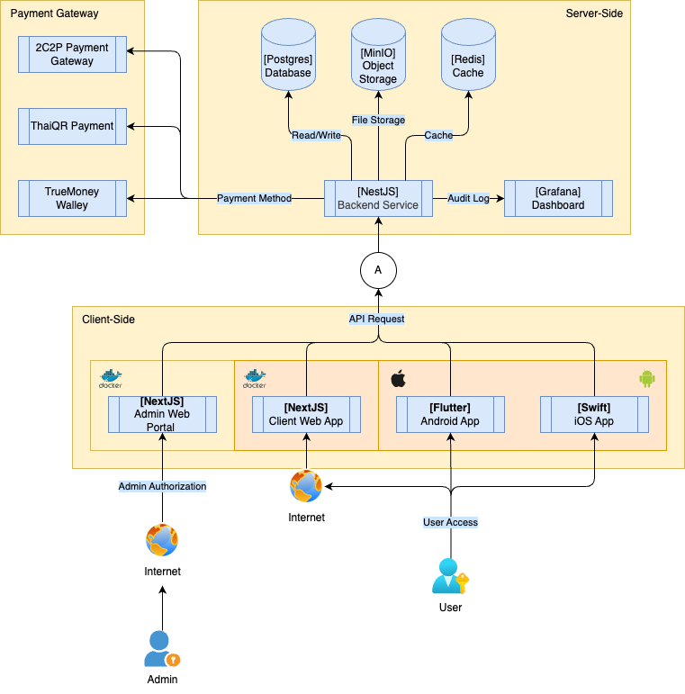
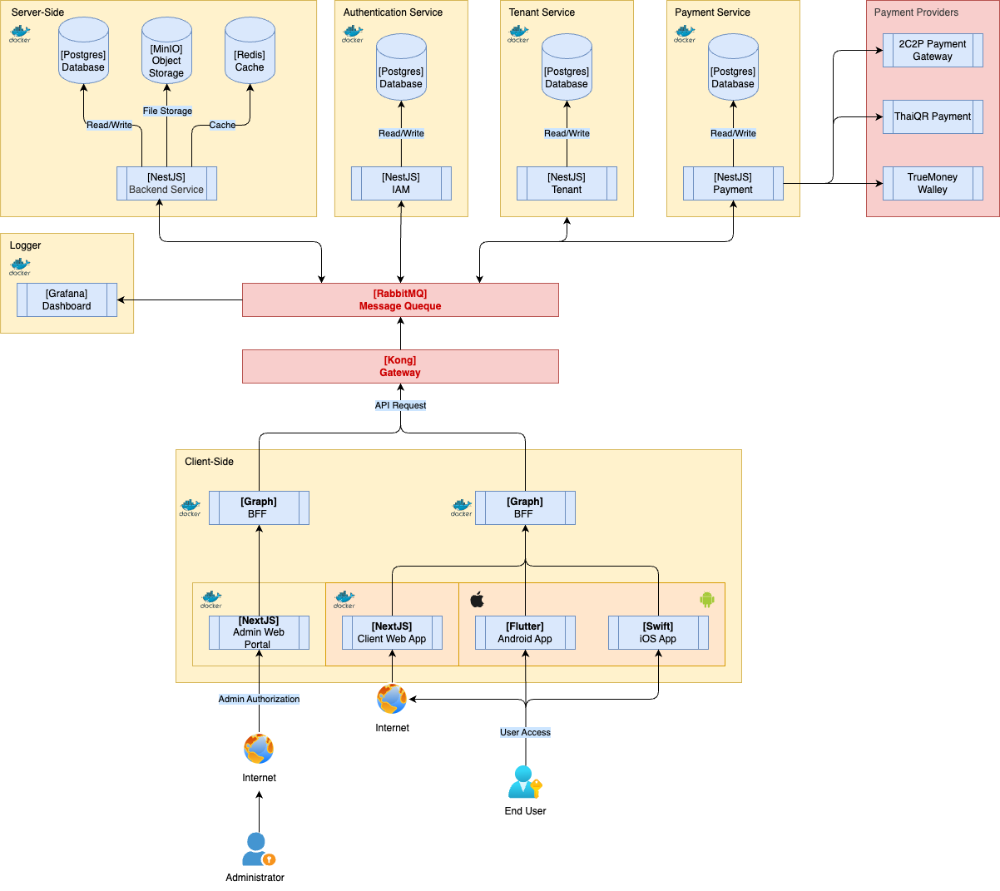

# TECHNICAL DESIGN

## Architecture Snapshot

### Phase 1 — Monolith + Single Tenant



**Architecture**: Modular Monolith
  - Reduces overall system complexity in the early stage.
  - Encourages clear **domain separation** from the beginning.
  - Makes it easier to **extract services** when evolving to microservices later.

#### Primary Technology Stack

- **Web Application: Next.js - TypeScript**
  - A framework for building web applications that supports both SSR (Server-Side Rendering) and CSR (Client-Side Rendering).
  - Suitable for SaaS platforms that require SEO, strong performance, and scalability.
  - TypeScript improves maintainability for large codebases through **type safety** and better developer tooling.

- **Mobile Application**
  - **iOS: Swift (Native)**
    - Uses native development to fully leverage iOS capabilities.
    - Provides the best performance and user experience within the Apple ecosystem.
  - **Android: Flutter**
    - Uses a cross-platform framework to accelerate development speed.
    - Reduces maintenance overhead and simplifies codebase management for small teams.

- **Backend: NestJS - TypeScript**
  - Well-suited for starting with a Modular Monolith architecture and evolving into Microservices in the future.
  - TypeScript improves maintainability of large codebases through **type safety** and modern tooling.

- **Database: PostgreSQL (single instance)**
  - A widely used relational database for SaaS platforms.
  - Supports logical data organization through schemas.
  - Enables read scaling using read replicas.
  - Has a mature ecosystem and can evolve toward distributed architecture in later stages.

- **File Storage: MinIO (S3-compatible Object Storage)**
  - Used for storing application files such as user uploads, documents, and media assets.
  - Provides an **S3-compatible API**, making it easy to migrate to cloud storage services in the future.
  - Suitable for local development and self-hosted environments during the early stage.
  - Can evolve into managed cloud storage such as **AWS S3**, **Google Cloud Storage**, or **Azure Blob Storage** as the system grows.

- **Cache: Redis**
  - An in-memory data store with very low latency (sub-millisecond).
  - Ideal for caching, session storage, and rate limiting.
  - Helps reduce database load and improve API performance.

- **Infrastructure: Single VM / Docker Container**
  - Starts with a single VM for simplicity in setup and deployment.
  - Uses Docker containers to ensure consistent environments across development and production.
  - Services can initially be managed through `docker-compose`.

- **Logging & Observability: Grafana**
  - Provides visibility into system performance and application behavior.
  - **Grafana** is used to visualize system metrics through monitoring dashboards.
  - Helps track key indicators such as API response time, system resource usage, and error rates.
  - Makes it easier to detect issues and monitor system health in production.

---

### Phase 2 — Pilot Tenant & Scalable Architecture



Architecture: Hybrid Service Architecture
  - The system begins onboarding **Pilot Tenants**, resulting in increased user activity and higher **system load**.
  - Some **modules** start being extracted into **independent services** to improve scalability.
  - Critical components such as the **Authentication Service** are separated into their own service to support **centralized authentication** across the platform.
  - This phase represents a transition stage from a **Monolith** toward a **Microservices architecture** in the future.

#### Additional Technology Stack

- API Gateway: Kong Gateway
  - Uses **Kong Gateway** as the entry point for all **API requests** from clients before forwarding them to backend services.  
  - Handles important concerns such as **authentication, rate limiting, and API security** at the gateway layer.  
  - Supports a **plugin-based architecture**, allowing new capabilities to be added without modifying backend services.  
  - Helps manage **API traffic and communication between clients and services** in a more structured way.  
  - Designed to scale well and support a transition to **microservices architecture** in the future.

- Backend for Frontend (BFF): GraphQL 
  - Introduces a **GraphQL BFF** layer to provide flexible APIs for different clients such as **Web Applications** and **Mobile Apps**.
  - Allows clients to request only the data they need from multiple **backend services**.
  - Aggregates data from different services into a single response.
  - Reduces the number of API calls from the client and simplifies frontend development.

- Messaging Queue: RabbitMQ
  - Introduces a **message queue** for tasks that do not require immediate processing.
  - Supports **background jobs** such as sending **notifications**.
  - Reduces API workload and improves the system’s ability to handle increased traffic.

- Database: PostgreSQL (Partial Service Separation)
  - The data structure gradually aligns with **service boundaries**.
  - Some extracted services may begin to have their own **data ownership**.
  - The system may still operate on a **single PostgreSQL instance** to reduce operational complexity.
  - **Read replicas** can be introduced to distribute database read load as traffic grows.

- Infrastructure: Containerized Services
  - Services start running in **Docker containers**.
  - Ensures consistent **environments** across development and production.
  - Allows individual services to **scale independently** as traffic increases.
  - Prepares the infrastructure for **Kubernetes** adoption in the next phase.

---
### Phase 3 — Microservices + Full Multi-Tenant


Architecture: Distributed Microservices Platform
  - The system evolves into a full **Microservices architecture**.
  - Each **service** can be developed, deployed, and scaled independently.
  - Supports a **Full Multi-Tenant SaaS platform** where multiple organizations can use the system simultaneously.
  - Provides **centralized authentication and access control** to manage system access securely.
  - Enables easier ecosystem expansion and the addition of new products in the future.

#### Primary Technology Stack

- Backend: Independent NestJS Microservices
  - The system is split into multiple **independent services**.
  - Each service owns its **domain responsibility**.
  - Services can be deployed and scaled independently without affecting others.

- API Gateway: Dedicated Gateway Layer
  - Uses an **API Gateway** as the main entry point for all client requests.
  - Responsible for **request routing**, **authentication**, and **traffic control**.
  - Simplifies access management across different services.

- BFF: GraphQL Backend for Frontend
  - Provides a **client-oriented API layer** between frontend applications and backend microservices.
  - Aggregates data from multiple services into a single response.
  - Allows clients to request only the data they need.
  - Simplifies frontend integration across multiple services.

- Identity & Access Control
  - Uses a **centralized identity service** for managing **authentication and authorization**.
  - Supports **Attribute-Based Access Control (ABAC)** to define access permissions based on attributes.
  - Policies can be defined using attributes such as **user role, tenant, resource, action, or context**.
  - Supports **Single Sign-On (SSO)** so users can access multiple services with a single login.

- Databases: Database per Service
  - Each **service** owns its own **database**.
  - Reduces tight coupling between services.
  - Allows services to scale and evolve independently.

- Cache: Redis Cluster
  - Uses **Redis Cluster** for caching and session management.
  - Reduces database load and improves API performance.

- Messaging: Event Streaming / Queue
  - Uses **event-driven communication** between services.
  - Allows services to interact asynchronously.
  - Suitable for background processing and event handling.

- Infrastructure: Container Orchestration
  - Uses **container orchestration** such as **Kubernetes** to manage services.
  - Supports efficient deployment, scaling, and infrastructure management.

---

== AI Mock up ==

## Evolution Phases

The system architecture is designed to evolve through multiple phases as the product grows.

### Phase 1 — Monolith + Single Tenant

Initial stage focuses on speed of development and simplicity.

Characteristics:
- Single monolithic application
- Single database
- Single tenant deployment
- Shared infrastructure
- Suitable for early product validation

```
Client
   │
   ▼
Monolith Application
   │
   ▼
Database
```

---

### Phase 2 — Microservices + Pilot Tenants

As the system grows, core domains start separating into services and limited tenants are onboarded.

Characteristics:
- Selected domains extracted into microservices
- Early tenant support
- Shared infrastructure with tenant-aware design
- API-based service communication

Example service split:

- User Service
- Order Service
- Payment Service

```
Client
   │
   ▼
API Gateway
   │
   ├── User Service
   ├── Order Service
   └── Payment Service

Service Databases (partial)
```

---

### Phase 3 — Microservices + Full Multi-Tenant

The platform evolves into a scalable SaaS platform supporting multiple tenants.

Characteristics:
- Fully modular microservices
- Multi-tenant architecture
- Tenant-aware data isolation
- Independent service deployments
- Horizontal scalability

```
Clients (Multiple Tenants)
        │
        ▼
     API Gateway
        │
        ├── Identity Service
        ├── Order Service
        ├── Payment Service
        ├── Catalog Service
        └── Notification Service

Service Databases
Tenant-aware storage
```

---

## High Level Architecture

```
Client (Web / Mobile)
        │
        ▼
 API / Web Layer
        │
        ▼
 Application Server (Monolith)
        │
        ▼
     Database
```

External systems may include:

- Payment Gateway
- Email / Notification Service
- Object Storage

---

## Core Components

| Component          | Role                                         |
| ------------------ | -------------------------------------------- |
| API Layer          | Handles HTTP requests and routing            |
| Application Core   | Main business logic                          |
| Background Workers | Async jobs such as email or order processing |
| Database           | Persistent transactional storage             |
| Cache              | Improve read performance                     |

---

## Internal Modules

The system is structured as a modular monolith.

| Module  | Responsibility              |
| ------- | --------------------------- |
| User    | Accounts and authentication |
| Product | Product catalog management  |
| Cart    | Shopping cart operations    |
| Order   | Order lifecycle             |
| Payment | Payment integration         |

---

## Data Storage

| Storage        | Purpose                     |
| -------------- | --------------------------- |
| PostgreSQL     | Core transactional data     |
| Redis          | Caching and session storage |
| Object Storage | Product images and media    |

---

## External Integrations

| System          | Usage                    |
| --------------- | ------------------------ |
| Payment Gateway | Process payments         |
| Email Service   | Send order confirmations |
| SMS Provider    | Send OTP / notifications |

---

## Example Technical Flow

### Checkout Flow

1. User confirms items in cart
2. Order module creates order record
3. Payment module calls payment gateway
4. Payment result updates order status
5. Confirmation email is sent

---

## Scaling Strategy

Typical scaling approach:

- Stateless application servers
- Horizontal scaling via load balancer
- Redis caching for heavy reads
- Database read replicas for reporting
